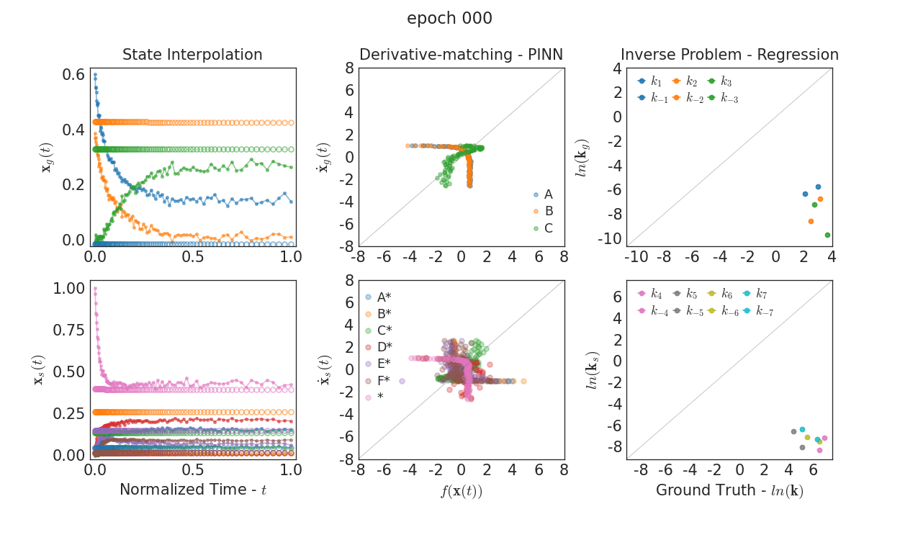

### KINNs: Kinetics-Informed Neural Networks
---
#### Pareto %2B Regularization Approach

arXiv: https://doi.org/10.48550/arXiv.2011.14473

***Exemplary KINNs training*** for the *gdacs* reaction type

  

The kinetic model represents the following fully-reversible chemical reactions.   
The latent Kinetics type *d* involves ad/desorption steps and a surface reaction between adsorbed molecules.   
An intermediate species (radicals, ) that do not have a corresponding gas phase species is part of the reaction, type *c*.   
Reaction between radicals , , and , adds further complexity to surface reaction, type *s*.   

   

   

   

   

   

   

    

Raw preliminary [JAX](https://github.com/google/jax)-based source code can be found under [kinn](./kinn).

#### Reference Jupyter Notebooks

   1. Combined data generation  can be found [here](./paper/kinn_datagen_reg.ipynb).
   2. Data digestion and plot generation [here](./paper/kinn_plotsgen.ipynb).
