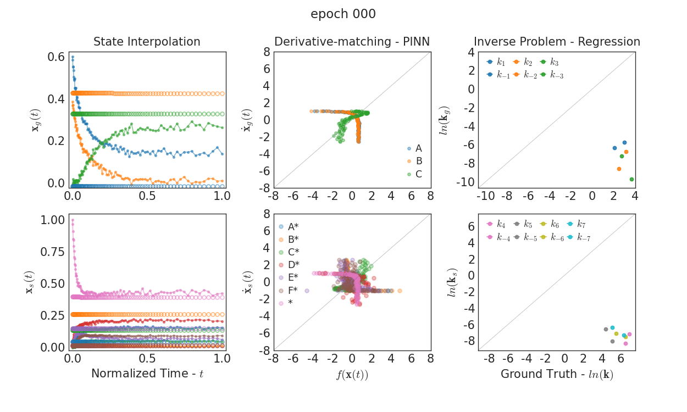

# KINNs: Kinetics-Informed Neural Networks


`kinn` solves forward kinetic trajectories and inverse parameter-estimation problems with JAX neural surrogates. The MLE variance propagation and SVD decomposition developed on the `rkinns` branch are included in the same package, alongside the original fixed-weight loss for Pareto studies. Install `kinn`, import `kinn`, and run the `kinn` command.

## Run locally

```sh
git clone --branch kinn-cli https://github.com/gusmaogabriels/kinn.git
cd kinn
python -m venv .venv
source .venv/bin/activate
python -m pip install .

kinn example --mode inverse --kind adsorption --output problem.json
kinn validate problem.json
kinn run problem.json --output result.json
```

On Windows PowerShell, activate with `.venv\Scripts\Activate.ps1` instead. Python 3.11 or newer is required. Computation runs on your machine. The example defaults to MLE covariance weighting with SVD. Use `--mode forward` when rate constants are known.

| Training option within `kinn` | Example configuration | Residual weighting |
| --- | --- | --- |
| MLE with SVD (default) | `--method rkinn` | Automatic covariance weighting and local variance propagation |
| Original fixed-weight loss | `--method kinn` | Physics MSE + `alpha` × data MSE |

The `method` values select training formulations inside `kinn`. Both support forward trajectory fitting with fixed rates and inverse fitting of trajectories and rate constants.

Inputs specify species, the stoichiometric matrix, surface species and vacant sites, observations, initial conditions, hidden-layer widths and activation functions. Results contain rates, trajectories, convergence diagnostics, physical checks and timings. `kinn schema` and `kinn capabilities` describe the input contract for programs and agents.

See the [CLI and input guide](./docs/cli.md) for all four method/mode combinations, CSV measurements, multiple experiments, uncertainty interpretation and JIT timing. The [examples](./examples) contain complete JSON inputs. From Python:

```python
from kinn import solve
result = solve("problem.json")
print(result["status"], result["rate_constants"])
```

## Pareto + Regularization Approach

arXiv: https://doi.org/10.48550/arXiv.2011.14473

**Try it live:** an interactive, in-browser version of the KINNs inverse-kinetics solver runs at **[gabrielgusmao.com/blog/kinns-playground](https://www.gabrielgusmao.com/blog/kinns-playground/)**: recover rate constants from noisy transient data with JAX-style autodiff and MLE uncertainty, no install. See also the [Lotka-Volterra Neural ODE](https://www.gabrielgusmao.com/blog/node-lv-playground/) and [pharmacokinetics Neural ODE](https://www.gabrielgusmao.com/blog/pkpd-playground/) playgrounds.

***KINNs training example*** for the *dcs* reaction type

<p align="center">
  
</p>

$`\dot{\mathbf{x}}(t)`$ is obtained by automatic differentiation of the neural-network trajectory $`\mathbf{x}(t)`$ with respect to time $`t`$. The physical model (microkinetic model) is denoted by $`f_{\mathbf{p}}(\cdot)`$, with parameters $`\mathbf{p}=\ln(\mathbf{k})`$.

The kinetic model represents the following fully reversible chemical reactions. Type *d* involves adsorption/desorption steps. Type *c* introduces surface intermediates, such as $`D^*`$, without a corresponding gas-phase species. Reactions between radicals $`D^*`$, $`E^*`$, and $`F^*`$ add further complexity, type *s*.

Here $`*`$ denotes a vacant surface site, and $`k_i`$ and $`k_{-i}`$ denote the forward and reverse rate constants for each reaction pair. The notebook stores the fourteen constants in interleaved forward/reverse order.

```math
\begin{aligned}
A + * &\underset{k_{-1}}{\overset{k_1}{\rightleftharpoons}} A^* \\
B + * &\underset{k_{-2}}{\overset{k_2}{\rightleftharpoons}} B^* \\
C + * &\underset{k_{-3}}{\overset{k_3}{\rightleftharpoons}} C^* \\
A^* + * &\underset{k_{-4}}{\overset{k_4}{\rightleftharpoons}} 2D^* \\
B^* + * &\underset{k_{-5}}{\overset{k_5}{\rightleftharpoons}} 2E^* \\
D^* + E^* &\underset{k_{-6}}{\overset{k_6}{\rightleftharpoons}} F^* + * \\
F^* + E^* &\underset{k_{-7}}{\overset{k_7}{\rightleftharpoons}} C^* + *
\end{aligned}
```

The [JAX](https://github.com/jax-ml/jax)-based kinetic models, neural networks and trainers are under [kinn](./kinn).

## Reference Jupyter Notebooks

1. [Data generation and KINNs training](./paper/kinn_datagen_reg.ipynb).
2. [Data processing and plot generation](./paper/kinn_plotsgen_reg.ipynb).

The corresponding Python sources are [kinn_datagen_reg.py](./paper/kinn_datagen_reg.py) and [kinn_plotsgen_reg.py](./paper/kinn_plotsgen_reg.py). The original kinetic model, neural network, and training loop live in [kinn/basis](./kinn/basis); the paper-specific constraints, loss, and benchmark systems are in [trainer_source.py](./paper/trainer_source.py).


## MLE, SVD and automatic variance propagation

The [rKINNs paper](https://arxiv.org/abs/2304.05991) describes the MLE and SVD extension implemented in the repository's `rkinns` branch. Its original implementation in [basis/mle.py](./kinn/basis/mle.py) is part of `kinn`; the CLI uses it to update covariance weights during training.

For independent state and log-rate errors, the local RHS covariance is propagated as:

```math
\Sigma_f(t) = J_x(t)\Sigma_x J_x(t)^T + J_p(t)\Sigma_p J_p(t)^T.
```

The CLI reports empirical first-order error covariances, with explicit rank and numerical-regularization diagnostics. These are not posterior credible intervals or calibrated parameter confidence intervals. Forward runs keep rates fixed; original KINNs retains its weighted objective without covariance estimation. See the [variance and result guide](./docs/cli.md#results-and-variance-propagation) for the assumptions and scope.

The original rKINNs [notebook](./paper/rkinn.ipynb) and [Python source](./paper/rkinn.py) are retained alongside the KINNs reference material.
