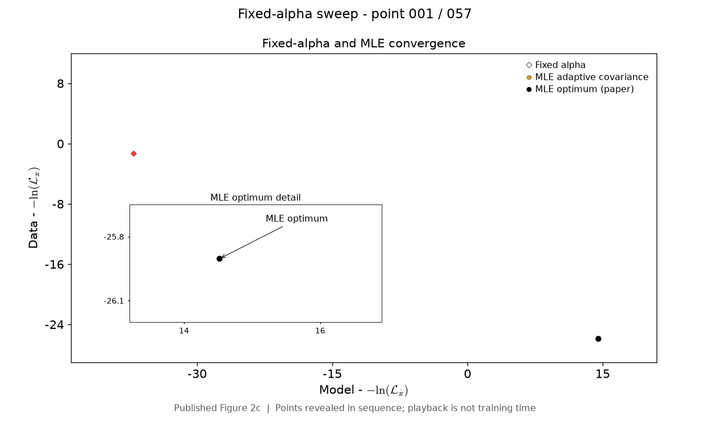

# kinn: Kinetics-Informed Neural Networks

`kinn` fits neural-network trajectories to kinetic models and measurements using JAX. It supports forward problems with known rate constants and inverse problems that estimate rates from measurements. Both modes support fixed residual weighting or MLE adaptive covariance weighting. The MLE formulation includes SVD conservation constraints and, for inverse problems, automatic variance propagation.

## Run locally

Python 3.11 or newer is required. The distribution is named `kinnlib`; the Python import and command are both `kinn`.

```sh
python -m venv .venv
source .venv/bin/activate
python -m pip install kinnlib
```

On Windows PowerShell, activate with `.venv\Scripts\Activate.ps1` instead. Installation provides the `kinn` Python package and the `kinn` command. `python -m kinn` is an equivalent entry point. Training runs locally on the machine where you invoke it.

To install from source instead:

```sh
git clone https://github.com/gusmaogabriels/kinn.git
cd kinn
python -m pip install .
```

### Estimate rate constants from measurements

Generate an adsorption example, check its inputs, and solve the inverse problem:

```sh
kinn example --method mle --mode inverse --kind adsorption --output inverse.json
kinn validate inverse.json
kinn run inverse.json --output inverse-result.json
```

The example describes A + * ⇌ A*, observes the bulk species A, and supplies a known initial state. Its synthetic measurements use rates `[2, 1]`; inference starts from `[1.5, 0.7]`. Replace the measurements and mechanism with your own, or provide a CSV through `data_file` as described in the [input guide](./docs/cli.md#input-contract).

### Fit a trajectory with known rate constants

```sh
kinn example --method mle --mode forward --kind homogeneous --output forward.json
kinn validate forward.json
kinn run forward.json --output forward-result.json
```

This example fits a neural trajectory for A ⇌ B with known rates `[2, 1]` and initial state `[1, 0]`. Forward training matches the network's time derivative to the kinetic model while enforcing the supplied initial state. Rates remain unchanged under either training method; forward inputs contain no measured `values`.

### Choose the training objective

`mode` selects what is fitted; `method` selects the residual weighting and its associated original surrogate parameterization. These are independent choices in one package, `kinn`. When `method` is omitted, it defaults to `mle`.

| `mode` | `method` | Fitted quantities | Objective |
| --- | --- | --- | --- |
| `forward` | `fixed` | Neural trajectory; supplied rates stay fixed | Physics MSE |
| `forward` | `mle` | Neural trajectory; supplied rates stay fixed | Physics residual with adaptive covariance weighting |
| `inverse` | `fixed` | Neural trajectory and rate constants | Physics MSE + `alpha` × data MSE |
| `inverse` | `mle` | Neural trajectory and rate constants | Data and physics residuals with adaptive covariance weighting and local variance propagation |

To generate inputs for the original fixed-weight formulation:

```sh
kinn example --method fixed --mode forward --kind homogeneous --output fixed-forward.json
kinn example --method fixed --mode inverse --kind adsorption --output fixed-inverse.json
kinn validate fixed-inverse.json
kinn run fixed-inverse.json --output fixed-inverse-result.json
```

For inverse `fixed` problems, `training.alpha` is a positive scalar held constant throughout one `kinn run`. It defaults to `1`; the generated fixed inverse examples explicitly choose `100`. Repeat the same problem with different alpha values to study the data/physics tradeoff. Forward `fixed` problems have no data term, so alpha has no effect.

MLE updates covariance matrices during training, rather than tuning a scalar alpha. Omit `training.alpha` for `mle`; validation rejects it. Architecture, learning rate and training budget remain configurable for both methods.

`--method` and `--mode` are flags for `kinn example`. To solve your own input, set `method` and `mode` inside the JSON; `kinn run` reads them from that file.

## Reproduce the paper experiments

The CLI includes the original four mechanisms, both initial conditions, and 21 saved fixed-weight training archives. Re-evaluate a reference experiment with its trajectories, derivatives, parameters, calibration scales and Pareto history:

```sh
python -m pip install "kinnlib[reproduce]"
kinn reproduce list
kinn reproduce run trainer_invvwn_3_alpha13 --output paper-example --plots
```

Fresh fixed-weight training is also available with the saved architectures and stage schedules:

```sh
kinn reproduce plan trainer_fwd_0_alpha13 --output training-plan.json
kinn reproduce train trainer_fwd_0_alpha13 --output fresh-forward --plots
```

Evaluating a saved archive and training afresh are separate operations. These reference commands currently cover the fixed-weight paper experiments; full reproduction of both papers remains incomplete. The [reproduction guide](./docs/reproduction.md) describes the available experiments, checkpoint selection and exported files. General forward and inverse problems with MLE weighting use `kinn run` as shown above.

## Define a kinetic problem

Inputs describe the mechanism, datasets and surrogate architecture. A complete forward input for A ⇌ B with MLE covariance weighting is:

```json
{
  "schema_version": 1,
  "method": "mle",
  "mode": "forward",
  "species": ["A", "B"],
  "stoichiometry": [[-1, 1], [1, -1]],
  "rate_constants": [2, 1],
  "datasets": [{
    "times": [0, 0.1, 0.2, 0.4, 0.7, 1],
    "initial_state": [1, 0]
  }],
  "surrogate": {
    "layers": [16, 16],
    "activations": "tanh"
  },
  "units": {"time": "s", "bulk": "normalized concentration"}
}
```

The stoichiometric matrix has **species rows and directed reaction columns**. Negative entries are reactants and positive entries are products. Each reversible reaction needs two columns and two rate constants, in matching order. Reaction orders follow the negative entries of the matrix.

For surface mechanisms, include adsorbates and vacant sites in `species` and identify them in `surface_species`. The current CLI supports one conserved site balance with equal site occupancy: the surface rows must sum to zero in every reaction column, and initial surface fractions must sum to one. Bulk concentrations and surface fractions must use compatible normalization for the supplied matrix.

Forward inputs supply `rate_constants` and a full `initial_state` for every dataset. Inverse inputs instead supply `initial_rate_constants`, `observed_species`, and `values` or a CSV `data_file` for each dataset. Observations may cover all bulk species or all species. Multiple datasets can have different time grids and separate neural trajectories while sharing kinetic parameters. A supplied `initial_state` is enforced exactly; it is required for forward problems and optional for inverse problems.

Set hidden-layer widths with `surrogate.layers`. Activations may be one name for all layers or a list with one name per layer: `tanh`, `sigmoid`, `swish`, `softplus`, `sin` or `gaussian`. Training settings include epochs, optimizer steps per epoch, learning rate, seed and residual tolerances. `training.warmup_steps` initializes the data fit in inverse mode. Forward convergence uses `physics_tolerance`; inverse convergence also requires `data_tolerance`.

The input contract currently covers closed, isothermal, well-mixed mass-action systems. Arbitrary rate laws, multiple surface site types and partial observations of bulk species need extensions to that contract. See the [CLI and input guide](./docs/cli.md) for the full settings, units and constraints; the [examples](./examples) contain complete inputs.

## Use results from Python or another program

The Python API accepts the same JSON file or an equivalent dictionary:

```python
from kinn import solve

result = solve("inverse.json")
print(result["status"])
print(result["rate_constants"])
print(result["uncertainty"])
```

| Result field | Contents |
| --- | --- |
| `mode`, `method` | The problem mode and training method used |
| `status` | Whether residual tolerances and sampled physical checks passed |
| `rate_constants`, `log_rate_constants` | Supplied rates in forward mode, fitted rates in inverse mode; reaction-column order |
| `predictions` | Times and predicted states for each dataset, in input species order |
| `history` | Epoch, data RMSE and physics RMSE throughout training |
| `uncertainty` | Final empirical covariance estimates for MLE; `method: "not_estimated"` for fixed weighting |
| `physical_checks` | Sampled nonnegativity and surface-site balance checks |
| `timing` | Setup, first-epoch, warm execution and total solve timings |

Inverse MLE results include state-residual, log-rate, rate and time-dependent kinetic-RHS error covariance. Rank-deficient kinetic sensitivities produce `null` rate-error covariances with a diagnostic. Forward MLE results report `physics_defect_covariance`; they do not estimate uncertainty in the supplied rates. Fixed weighting does not estimate covariance in either mode.

For general problems, `kinn run` stores final results and RMSE history, but does not yet export neural weights, reloadable checkpoints or parameter/covariance histories. The separate `kinn reproduce` commands export the fixed-weight reference experiment parameters and saved stages; see the [reproduction guide](./docs/reproduction.md). These paper-specific exports have a different scope from a general solve.

For programs and agents, `kinn capabilities` describes supported operations and `kinn schema` prints the JSON Schema. `kinn validate` checks the input without importing JAX or training. A run exits with code `0` on convergence with sampled physical checks, `1` on nonconvergence or numerical failure, and `2` on an input or file error. Inspect `status` before using a result.

The [original ten-species, fourteen-rate DCS example](./examples/mle-dcs-forward.json) is a more demanding benchmark. Its current default budget reaches `max_epochs`; it is useful for evaluating architectures and convergence, and is not a demonstrated converged CLI example.

## JAX execution and timing

Neural evaluations, time derivatives, kinetic Jacobians and optimizer steps use JAX. Compiled blocks of optimizer steps reuse their compiled program during a solve. Validation, convergence decisions and file handling run in Python.

The first-epoch timing includes compilation on first use. Warm epoch timings include covariance refresh and diagnostics; warm optimizer-kernel timings isolate the optimizer steps. JAX results are synchronized before timings are recorded. `wall_seconds` includes setup and uncertainty reporting but excludes Python/import startup; [the timing benchmark](./benchmarks/cli_timing.py) also measures fresh-process wall time. See the [timing guide](./docs/cli.md#jax-execution-and-timings) for details.

CI covers Linux, macOS and Windows, supported dependency combinations, numerical examples, covariance propagation and installation of the built wheel.

## Citation

For research using KINN, cite the software version or source revision used and the applicable methods papers. [CITATION.cff](./CITATION.cff) contains software and paper citation metadata.

- Gabriel S. Gusmão, Adhika P. Retnanto, Shashwati C. da Cunha and Andrew J. Medford. [Kinetics-informed neural networks](https://doi.org/10.1016/j.cattod.2022.04.002). *Catalysis Today* (2023).
- Gabriel S. Gusmão and Andrew J. Medford. [Maximum-likelihood estimators in physics-informed neural networks for high-dimensional inverse problems](https://doi.org/10.1016/j.compchemeng.2023.108547). *Computers & Chemical Engineering* (2024).

## Adaptive covariance weighting during training

During MLE training, KINNs estimates covariance from sampled residuals and propagates state and parameter uncertainty through the kinetic model. The resulting inverse covariance matrices weight the data and physics residuals. They are refreshed between training cycles and held fixed within each block of parameter updates, as described in the [MLE paper](https://arxiv.org/abs/2304.05991).

The [mathematical formulation](#mathematical-formulation) below explains the residuals, SVD projection and covariance updates.

The comparison below shows this adaptive trajectory alongside the regularization sweep from the [original fixed-alpha formulation](https://doi.org/10.48550/arXiv.2011.14473), evaluated in the same likelihood coordinates.

<p align="center">
  
</p>

*Animated redraw of [Figure 2c of the MLE paper](https://arxiv.org/html/2304.05991v2#S2.F2).* Fixed-alpha and MLE paths share the paper's likelihood coordinates. Arrows mark increasing alpha on the tightening branch and decreasing alpha on the relaxation branch. The black circle marks the paper's final MLE estimate, enlarged in the inset. Frames reveal every published point, with faster playback near convergence; playback does not represent training time.

## MLE training example

The [MLE paper](https://arxiv.org/abs/2304.05991) extends KINNs with adaptive covariance weighting, SVD coordinates and automatic variance propagation. The animation below illustrates inverse fitting for the DCS mechanism.

**Try it live:** an interactive, in-browser version of the KINNs inverse-kinetics solver runs at **[gabrielgusmao.com/blog/kinns-playground](https://www.gabrielgusmao.com/blog/kinns-playground/)**: recover rate constants from noisy transient data with JAX-style autodiff and MLE uncertainty, no install. See also the [Lotka-Volterra Neural ODE](https://www.gabrielgusmao.com/blog/node-lv-playground/) and [pharmacokinetics Neural ODE](https://www.gabrielgusmao.com/blog/pkpd-playground/) playgrounds.

***KINNs with MLE adaptive covariance*** for the *dcs* reaction type

<p align="center">
  
</p>

$`\dot{\mathbf{x}}(t)`$ is obtained by automatic differentiation of the neural-network trajectory $`\mathbf{x}(t)`$ with respect to time $`t`$. The physical model (microkinetic model) is denoted by $`f_{\mathbf{p}}(\cdot)`$, with parameters $`\mathbf{p}=\ln(\mathbf{k})`$.

The kinetic model represents the following fully reversible chemical reactions. Type *d* involves adsorption/desorption steps. Type *c* introduces surface intermediates, such as $`D^*`$, without a corresponding gas-phase species. Reactions between radicals $`D^*`$, $`E^*`$, and $`F^*`$ add further complexity, type *s*.

Here $`*`$ denotes a vacant surface site, and $`k_i`$ and $`k_{-i}`$ denote the forward and reverse rate constants for each reaction pair. The notebook stores the fourteen constants in interleaved forward/reverse order.

```math
\begin{aligned}
A + * &\underset{k_{-1}}{\overset{k_1}{\rightleftharpoons}} A^* \\
B + * &\underset{k_{-2}}{\overset{k_2}{\rightleftharpoons}} B^* \\
C + * &\underset{k_{-3}}{\overset{k_3}{\rightleftharpoons}} C^* \\
A^* + * &\underset{k_{-4}}{\overset{k_4}{\rightleftharpoons}} 2D^* \\
B^* + * &\underset{k_{-5}}{\overset{k_5}{\rightleftharpoons}} 2E^* \\
D^* + E^* &\underset{k_{-6}}{\overset{k_6}{\rightleftharpoons}} F^* + * \\
F^* + E^* &\underset{k_{-7}}{\overset{k_7}{\rightleftharpoons}} C^* + *
\end{aligned}
```

The [JAX](https://github.com/jax-ml/jax)-based kinetic models, neural networks and trainers are under [kinn](./kinn).

## Reference Jupyter Notebooks

The original fixed-alpha Pareto studies are retained in:

1. [Data generation and KINNs training](./paper/kinn_datagen_reg.ipynb).
2. [Data processing and plot generation](./paper/kinn_plotsgen_reg.ipynb).

The corresponding Python sources are [kinn_datagen_reg.py](./paper/kinn_datagen_reg.py) and [kinn_plotsgen_reg.py](./paper/kinn_plotsgen_reg.py). The original kinetic model, neural network, and training loop live in [kinn/basis](./kinn/basis); the paper-specific constraints, loss, and benchmark systems are in [trainer_source.py](./paper/trainer_source.py).

## Mathematical formulation

This section follows the [MLE paper](https://arxiv.org/html/2304.05991v2), which also states the original fixed-alpha KINNs objective. Equation references below identify the source of each part of the formulation. The paper denotes physical concentrations by $`\mathbf{c}`$, the surrogate trajectory by $`\mathbf{x}(t,\boldsymbol{\omega}_{\mathrm{s}})`$, and kinetic parameters by $`\mathbf{p}`$.

### Kinetics, residuals and fixed-alpha weighting

The kinetic model in [Eq. 2.1.1](https://arxiv.org/html/2304.05991v2#S2.SS1.E1) is

```math
\dot{\mathbf{c}}=f(\mathbf{c},\mathbf{p})
=\mathbf{M}\left(\mathbf{k}(\mathbf{p})\circ\psi(\mathbf{c})\right).
```

$`\mathbf{M}`$ has species rows and reaction columns, $`\psi`$ is the power-law kinetics map, and $`\circ`$ denotes elementwise multiplication. Temperature dependence is suppressed here. The surrogate approximates $`\mathbf{c}(t)`$, and its derivative is obtained by automatic differentiation.

[Eqs. 2.1.2–2.1.4](https://arxiv.org/html/2304.05991v2#S2.SS1.E2) define the interpolation and model residuals and the fixed-alpha objective over $`d`$ samples:

```math
\begin{aligned}
\boldsymbol{\varepsilon}_{\mathbf{x},i}
  &=\mathbf{x}(t_i,\boldsymbol{\omega}_{\mathrm{s}})-\tilde{\mathbf{x}}_i,\\
\boldsymbol{\varepsilon}_{\dot{\mathbf{x}},i}
  &=\dot{\mathbf{x}}(t_i,\boldsymbol{\omega}_{\mathrm{s}})-f(\mathbf{x}_i,\mathbf{p}),\\
j_{\mathrm{t}}
  &=\frac{1}{d}\sum_{i=1}^{d}
    \boldsymbol{\varepsilon}_{\dot{\mathbf{x}},i}^{T}\boldsymbol{\varepsilon}_{\dot{\mathbf{x}},i}
   +\frac{\alpha}{d}\sum_{i=1}^{d}
    \boldsymbol{\varepsilon}_{\mathbf{x},i}^{T}\boldsymbol{\varepsilon}_{\mathbf{x},i}.
\end{aligned}
```

Inverse fitting optimizes the neural weights and kinetic parameters at fixed $`\alpha`$. Sweeping alpha produces the regularization paths compared in Figure 2.

### Range and left-nullspace decomposition

For real-valued matrices, the SVD in [Eqs. 2.3.1–2.3.2](https://arxiv.org/html/2304.05991v2#S2.SS3.E1) can be written

```math
\mathbf{M}=\mathbf{U}\mathbf{S}\mathbf{V}^{T},\qquad
\mathbf{U}=\begin{bmatrix}\mathbf{U}^{\mathrm{R}}&\mathbf{U}^{\mathrm{N}}\end{bmatrix}.
```

The columns of $`\mathbf{U}^{\mathrm{R}}`$ span the range of $`\mathbf{M}`$. The columns of $`\mathbf{U}^{\mathrm{N}}`$ span its **left nullspace**, $`\ker(\mathbf{M}^{T})`$. For the closed kinetic system, [Eqs. 2.3.3–2.3.7](https://arxiv.org/html/2304.05991v2#S2.SS3.E3) give

```math
\begin{aligned}
\mathbf{z}^{\mathrm{R}}(t)&=(\mathbf{U}^{\mathrm{R}})^T\mathbf{c}(t),&
\mathbf{z}^{\mathrm{N}}&=(\mathbf{U}^{\mathrm{N}})^T\mathbf{c}(t),\\
\mathbf{c}(t)&=\mathbf{U}^{\mathrm{R}}\mathbf{z}^{\mathrm{R}}(t)
                  +\mathbf{U}^{\mathrm{N}}\mathbf{z}^{\mathrm{N}},&
\dot{\mathbf{z}}^{\mathrm{N}}&=\mathbf{0}.
\end{aligned}
```

Time dependence is represented in the range coordinates; the nullspace coordinates encode conserved quantities. For heterogeneous systems, the paper partitions these bases into bulk and surface rows and uses the normalization operator $`\mathrm{C}_{N}`$ to enforce the surface-site balance. The constrained surrogate construction is given in [Eqs. 4.7.1–4.7.2](https://arxiv.org/html/2304.05991v2#S4.SS7.E1).

### Covariance estimated from residuals and propagated through the model

[Eq. 4.1.5](https://arxiv.org/html/2304.05991v2#S4.SS1.E5) estimates the state-error covariance from centered residuals:

```math
\boldsymbol{\Sigma}_{\mathbf{x}}
=\left\langle
\left(\boldsymbol{\varepsilon}_{\mathbf{x}}-\langle\boldsymbol{\varepsilon}_{\mathbf{x}}\rangle\right)
\left(\boldsymbol{\varepsilon}_{\mathbf{x}}-\langle\boldsymbol{\varepsilon}_{\mathbf{x}}\rangle\right)^T
\right\rangle.
```

The paper obtains local parameter-error samples by the least-squares relation in [Eq. 4.1.4](https://arxiv.org/html/2304.05991v2#S4.SS1.E4), then estimates $`\boldsymbol{\Sigma}_{\mathbf{p}}`$ from those samples. These sampled errors differ from the unknown error relative to the true parameter vector.

The first-order expansion in [Eq. 2.2.2](https://arxiv.org/html/2304.05991v2#S2.SS2.E2) includes both the surrogate representation and kinetic-model contributions:

```math
\delta\boldsymbol{\varepsilon}_{\dot{\mathbf{x}}}
\simeq
\left(\partial_{\mathbf{x}}\dot{\mathbf{x}}-\partial_{\mathbf{x}}f\right)\delta\mathbf{x}
-\partial_{\mathbf{p}}f\,\delta\mathbf{p}.
```

The paper neglects $`\partial_{\mathbf{x}}\dot{\mathbf{x}}`$ under its stated approximation for a sufficiently expressive neural basis. Assuming independent, zero-mean Gaussian state and parameter perturbations, [Eq. 4.1.2](https://arxiv.org/html/2304.05991v2#S4.SS1.E2) then gives

```math
\begin{aligned}
\boldsymbol{\Sigma}_{\dot{\mathbf{x}},i}
&=\partial_{\mathbf{x}}f_i\,\boldsymbol{\Sigma}_{\mathbf{x}}\,
  (\partial_{\mathbf{x}}f_i)^T
 +\partial_{\mathbf{p}}f_i\,\boldsymbol{\Sigma}_{\mathbf{p}}\,
  (\partial_{\mathbf{p}}f_i)^T\\
&=\boldsymbol{\Sigma}^{\mathbf{x}}_{\dot{\mathbf{x}},i}
 +\boldsymbol{\Sigma}^{\mathbf{p}}_{\dot{\mathbf{x}},i},
\qquad f_i=f(\mathbf{x}_i,\mathbf{p}).
\end{aligned}
```

### Projected MLE objective and covariance updates

Project residuals into the range using $`(\mathbf{U}^{\mathrm{R}})^T`$. Here $`i`$ indexes samples and $`\mathrm{R}`$ denotes the range coordinates. With the residual signs defined above,

```math
\begin{aligned}
\boldsymbol{\varepsilon}_{\mathbf{z},i}^{\mathrm{R}}
 &=\bigl(\mathbf{U}^{\mathrm{R}}\bigr)^T
   \,\boldsymbol{\varepsilon}_{\mathbf{x},i},\\[6pt]
\boldsymbol{\varepsilon}_{\dot{\mathbf{z}},i}^{\mathrm{R}}
 &=\bigl(\mathbf{U}^{\mathrm{R}}\bigr)^T
   \,\boldsymbol{\varepsilon}_{\dot{\mathbf{x}},i}.
\end{aligned}
```

The precision matrices in [Eq. 4.7.3](https://arxiv.org/html/2304.05991v2#S4.SS7.E3) are the **inverses of the projected covariances**:

```math
\begin{aligned}
\boldsymbol{\Omega}_{\mathbf{z}}^{\mathrm{R}}
 &=\Bigl[
   \bigl(\mathbf{U}^{\mathrm{R}}\bigr)^T
   \,\boldsymbol{\Sigma}_{\mathbf{x}}
   \,\mathbf{U}^{\mathrm{R}}
   \Bigr]^{-1},\\[10pt]
\boldsymbol{\Omega}_{\dot{\mathbf{z}},i}^{\mathrm{R}}
 &=\Bigl[
   \bigl(\mathbf{U}^{\mathrm{R}}\bigr)^T
   \,\Bigl(
     \boldsymbol{\Sigma}^{\mathbf{x}}_{\dot{\mathbf{x}},i}
     +\boldsymbol{\Sigma}^{\mathbf{p}}_{\dot{\mathbf{x}},i}
   \Bigr)
   \,\mathbf{U}^{\mathrm{R}}
   \Bigr]^{-1}.
\end{aligned}
```

With $`d`$ denoting the number of samples, the reduced objective has a model-residual term and a data-residual term:

```math
\begin{aligned}
\min_{\boldsymbol{\omega}_{\mathrm{s}},\mathbf{p}}\quad
\ell_{\mathrm{t}}
 &=\frac{1}{d}\sum_{i=1}^{d}
   \Bigl(\boldsymbol{\varepsilon}_{\dot{\mathbf{z}},i}^{\mathrm{R}}\Bigr)^T
   \,\boldsymbol{\Omega}_{\dot{\mathbf{z}},i}^{\mathrm{R}}
   \,\boldsymbol{\varepsilon}_{\dot{\mathbf{z}},i}^{\mathrm{R}}\\[10pt]
 &\quad+\frac{1}{d}\sum_{i=1}^{d}
   \Bigl(\boldsymbol{\varepsilon}_{\mathbf{z},i}^{\mathrm{R}}\Bigr)^T
   \,\boldsymbol{\Omega}_{\mathbf{z}}^{\mathrm{R}}
   \,\boldsymbol{\varepsilon}_{\mathbf{z},i}^{\mathrm{R}}.
\end{aligned}
```

The paper holds precision matrices fixed during parameter updates, then recomputes residual covariances, kinetic sensitivities and projected precision matrices between epochs ([Algorithm 1](https://arxiv.org/html/2304.05991v2#alg1)). Gaussian normalization terms are constant within that parameter-update problem. The covariance stabilization in [Eq. 4.2.1](https://arxiv.org/html/2304.05991v2#S4.SS2.E1) adds a diagonal term based on the absolute residual mean. This is the paper's mechanism for adapting residual weights as training proceeds.

### Relation to the CLI

`mode` selects forward or inverse fitting; `method` selects `fixed` or `mle`. The general CLI's observed-species handling, separate time grids, OAS shrinkage, eigenvalue floor and uncentered state-residual second moments are implementation choices documented in the [CLI guide](./docs/cli.md#results-and-variance-propagation). They are not the paper's equations above. The package uses $`p_{\mathrm{CLI}}=\ln k`$; the Arrhenius convention beside paper Eq. 2.1.1 uses $`k=\exp(-p(\theta))`$.

The paper's parameter intervals additionally use likelihood-Hessian/Fisher-information analysis. General `kinn run` returns empirical error covariances and does not export those intervals. The original [notebook](./paper/rkinn.ipynb), [Python source](./paper/rkinn.py), and [MLE routines](./kinn/basis/mle.py) retain the research formulation.
